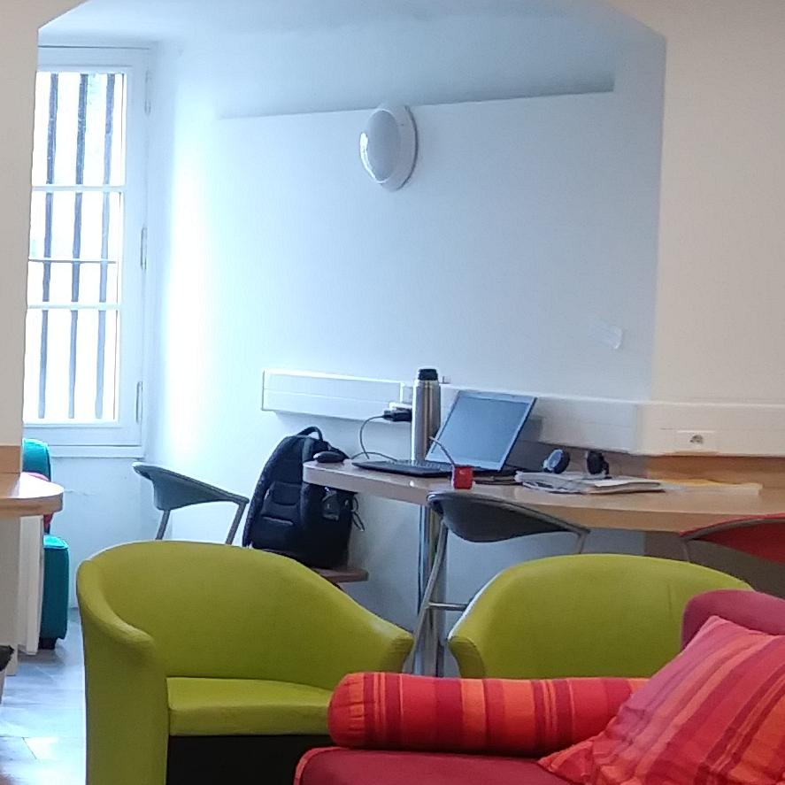

<style>
.slide-background:first-child {
  background-color: #766860;
}
</style>

```{r setup, include=FALSE}
knitr::opts_chunk$set(echo = FALSE)
```

```{css}

        
<style>
 .col2 {
  columns: 2 200px;
  -webkit-columns: 2 200px;
  -moz-columns: 2 200px
 }
 .col3 {
  columns: 3 100px;
  -webkit-columns: 3 100px;
  -moz-columns: 3 100px
 }
 
</style>

<style>
 .colum-left {
  float: left;
  width 33%;
  text-align: left;
 }
 .colum-center {
  display: inline-block;
  width 33%;
  text-align: center;
 }
 .colum-right {
  float: right;
  width 33%;
  text-align: center;
 }
</style>
```

```{r egokitu, message=FALSE}
require(diaMeasures)
require(factoextra)
require(FactoMineR)
require(fastDummies)
require(gridExtra)
require(plot3D)
require(reshape2)
require(scales)
require(scatterplot3d)
require(rgdal)
require(sp)
require(RColorBrewer)
require(rgl)

# require(gridExtra)
# require(leaflet)
# require(reshape2)
# require(rgl)

## Datuak sartu
dtk.brcz <- read.table('data/raw/bourciez-taulazabalduan-b.csv', sep = ',', header = T)
names(dtk.brcz) <- read.table('data/raw/bourciez-taulazabalduan-b.csv', sep = ',', stringsAsFactors = F)[1,]
row.names(dtk.brcz) <- dtk.brcz[,1] 
dtk.brcz <- dtk.brcz[,-1]
# NA gehiegi daukaz Hendaiak
dtk.brcz <- dtk.brcz[-which(row.names(dtk.brcz)=="Hendaia"),]

## Mapa Sartu
mapi <- suppressMessages(readOGR('data/maps/EH_Udalerriak-Barri/udalerriak_EH_berriaB.shp', verbose = FALSE))

# Koloreak esleitu
cols <- brewer.pal(8, 'Set1')

```

## Nondik nora  {data-background=#0061a9}

<div class="col3">
<div class="column-left">
> - Oinarrizkoak
> - Interpretazioa
> - Goebl-en analisiak
</div>

<div class="column-center">
> - Dimentsio Anitzetako Analisia
> - MCA Elementuei datxekien analisia
</div>

<div class="column-right">
> - MDS
> - MDS eta MCA
</div>
</div>

# Oinarrizkoak  {data-background=#dddddd}

## {data-background=#dddddd}

```{r inor, echo=FALSE}
##  Inor izenordain zehaztugabea 

mapi@data$inor <- NA

for(i in row.names(dtk.brcz)){
        # print(i)
        mapi@data[mapi@data$IZ_EUSKAL==i, 'inor'] <- as.character(dtk.brcz[i, '\"Inor\" izenordain zehaztugabea'])
}
mapi@data$inor <- factor(mapi@data$inor)
# mapi@data$inor[is.na(mapi@data$inor)] <- 1
##

plot(mapi, col=ifelse(is.na(mapi@data$inor), 1, cols[as.numeric(mapi@data$inor)]),
     main = 'Inor emateko moduak Bourciezen datuetan')
# mapi@data$inor <- factor(mapi@data$inor, levels = levels(dtk.brcz$inor))
legend("bottomleft",
       legend = levels(mapi@data$inor),
       title = 'formak',
       col = cols[1:length(levels(mapi@data$inor))],
       pch = 20)
```

## {data-background=#dddddd}


```{r zarata, echo=FALSE}
# par(mfrow = c(2,2))
mapi@data$bruit <- NA

for(i in row.names(dtk.brcz)){
        # print(i)
        mapi@data[mapi@data$IZ_EUSKAL==i, 'bruit'] <- dtk.brcz[i, "bruit"]
}

#

plot(mapi, col=ifelse(is.na(mapi@data$bruit), 1, cols[as.numeric(mapi@data$bruit)]),
     main = 'Frantsesezko bruit emateko moduak Bourciezen datuetan')
mapi@data$bruit <- factor(mapi@data$bruit, levels = levels(dtk.brcz$bruit))
legend("bottomleft",
       legend = levels(mapi@data$bruit),
       title = 'Formak',
       col = cols[1:length(levels(mapi@data$bruit))],
       pch = 20)
# par(mfrow = c(1,1))
```


##  {data-background=#999999}

```{r leiho, echo=FALSE}
# par(mfrow = c(2,2))
mapi@data$leiho <- NA

for(i in row.names(dtk.brcz)){
        # print(i)
        mapi@data[mapi@data$IZ_EUSKAL==i, 'leiho'] <- dtk.brcz[i, 25]
}

#

plot(mapi, col=ifelse(is.na(mapi@data$leiho), 1, cols[as.numeric(mapi@data$leiho)]),
     main = '\"leiho\" hitzaren aldaerak')
mapi@data$leiho <- factor(mapi@data$leiho, levels = levels(dtk.brcz[, 25]))
legend("bottomleft",
       legend = levels(mapi@data$leiho),
       title = 'Formak',
       col = cols[1:length(levels(mapi@data$leiho))],
       pch = 20)
# par(mfrow = c(1,1))
```


##  {data-background=#555555}

```{r ü, echo=FALSE}
# par(mfrow = c(2,2))
mapi@data$ü <- NA

for(i in row.names(dtk.brcz)){
        # print(i)
        mapi@data[mapi@data$IZ_EUSKAL==i, 'ü'] <- dtk.brcz[i, 36]
}

#

plot(mapi, col=ifelse(is.na(mapi@data$ü), 1, cols[as.numeric(mapi@data$ü)]),
     main = '\"ü/u\" soinua \'guti\' hitzean')
mapi@data$ü <- factor(mapi@data$ü, levels = levels(dtk.brcz[, 36]))
legend("bottomleft",
       legend = levels(mapi@data$ü),
       title = 'Formak',
       col = cols[1:length(levels(mapi@data$ü))],
       pch = 20)
# par(mfrow = c(1,1))
```


##  {data-background=#111111}

```{r zegoelarik, echo=FALSE}
# par(mfrow = c(2,2))
mapi@data$zegoelarik <- NA

for(i in row.names(dtk.brcz)){
        # print(i)
        mapi@data[mapi@data$IZ_EUSKAL==i, 'zegoelarik'] <- dtk.brcz[i, 43]
}

#

plot(mapi, col=ifelse(is.na(mapi@data$zegoelarik), 1, cols[as.numeric(mapi@data$zegoelarik)]),
     main = '\"zegoelarik/u\" soinua \'guti\' hitzean')
mapi@data$zegoelarik <- factor(mapi@data$zegoelarik, levels = levels(dtk.brcz[, 43]))
legend("bottomleft",
       legend = levels(mapi@data$zegoelarik),
       title = 'Formak',
       col = cols[1:length(levels(mapi@data$zegoelarik))],
       pch = 20)
# par(mfrow = c(1,1))
```


# Distantzi matrizeak {data-background=#f9f9c5}

## Distantziak <br> formen artean Vs lemen artean {data-background=#ece2c6}

<div class="col3"> 
<div class="column-left">

transkripzioen arteko distantziak

*aita > aitta > atta > atxa > atxe*

</div>
<div class="column-center">
ala
</div>
<div class="column-right">

elementu bakanen identifikazioa

*amama > amatxi > amona > amandrea*

</div>
</div>

## {data-background=#cbcba1}

<small>

```{r distantziak, warning=FALSE}
## Datuen prestaketa
dtk.tnp <- cbind(herria = row.names(dtk.brcz), dtk.brcz)
names.bcrz <- names(dtk.tnp)

dtk.bcrz.luze <- melt(dtk.tnp, id.vars = 'herria', variable.name = 'erantzunak')
d.brcz <- as.dist(diaMeasures::diaMeasure(data = dtk.bcrz.luze, 
                                  formula = herria~erantzunak, 
                                  value.var = 'value',
                                  measure = 'iri',
                                  binaryIndex = 'dice'))

dx <- as.matrix(d.brcz)[1:10,1:10]
row.names(dx) <- row.names(dtk.brcz)[1:10]
knitr::kable(dx, col.names = row.names(dtk.brcz)[1:10], row.names = T, digits = 2)

```

</small>


##  {data-background=#cbcba1}

```{r dendograma, warning=FALSE}
hc <- hclust(d.brcz, 
            method = 'ward.D2')
plot(hc , 
     labels = row.names(dtk.brcz),
     cex = 0.7,
     main = 'Multzokatze determinista',
     sub = 'Warden araberakoa')
rect.hclust(tree = hc, k = 3, border = 2)

```

##  {data-background=#cbcba1}

```{r mapa.ward.D2}
kutri <- cutree(hc, k = 3)

mapi@data$ward2 <- NA

for(i in row.names(dtk.brcz)){
        # print(i)
        mapi@data[mapi@data$IZ_EUSKAL==i, 'ward2'] <- kutri[i]
}

#
plot(mapi, col=ifelse(is.na(mapi@data$ward2), 1, cols[as.numeric(mapi@data$ward2)]),
     main = 'Multzokatze determinista', sub = 'Gutxieneko barne bariantza')
# mapi@data$ward2 <- factor(mapi@data$ward2, levels = levels(dtk.brcz[, 17]))
legend("bottomleft",
       legend = c('a', 'b', 'c'),
       title = 'Multzoak',
       col = cols[1:3],
       pch = 20)
```

## {data-background=#9f9e7f} 

```{r mapa.complete}
i <- "complete"
hx <- hclust(d.brcz, method = i)
kutrix <- cutree(hx, k= 3)
  for(j in row.names(dtk.brcz)){
        # print(i)
        mapi@data[mapi@data$IZ_EUSKAL==j, i] <- kutrix[j]
  }
plot(mapi, col=ifelse(is.na(mapi@data[,i]), 1, cols[as.numeric(mapi@data[,i])]),
     main = 'Multzokatze determinista', sub = i)

```

## {data-background=#9f9e7f} 

```{r mapa.average}
i <- "average"
hx <- hclust(d.brcz, method = i)
kutrix <- cutree(hx, k= 3)
  for(j in row.names(dtk.brcz)){
        # print(i)
        mapi@data[mapi@data$IZ_EUSKAL==j, i] <- kutrix[j]
  }
plot(mapi, col=ifelse(is.na(mapi@data[,i]), 1, cols[as.numeric(mapi@data[,i])]),
     main = 'Multzokatze determinista', sub = i)
```

## {data-background=#9f9e7f} 

```{r mapa.single}
i <- "single"
hx <- hclust(d.brcz, method = i)
kutrix <- cutree(hx, k= 3)
  for(j in row.names(dtk.brcz)){
        # print(i)
        mapi@data[mapi@data$IZ_EUSKAL==j, i] <- kutrix[j]
  }
plot(mapi, col=ifelse(is.na(mapi@data[,i]), 1, cols[as.numeric(mapi@data[,i])]),
     main = 'Multzokatze determinista', sub = i)
```

## {data-background=#9f9e7f} 

```{r war.d.mapa}
i <- "ward.D"
hx <- hclust(d.brcz, method = i)
kutrix <- cutree(hx, k= 3)
  for(j in row.names(dtk.brcz)){
        # print(i)
        mapi@data[mapi@data$IZ_EUSKAL==j, i] <- kutrix[j]
  }
plot(mapi, col=ifelse(is.na(mapi@data[,i]), 1, cols[as.numeric(mapi@data[,i])]),
     main = 'Multzokatze determinista', sub = i)
```

# Eskalatze Dimentsio Anitza (MDS) {data-background=#ffbfc6}

## 2D-edo {data-background=#ffbfc6}

```{r mds.2d}
## MDS
mds.bcrz <- cmdscale(d.brcz, k = 3)

## Koloreak
col.mds <- rgb(rescale(1-mds.bcrz[,], to = c(0, 1)))

## Irudiak ---------------------------
## 2D
plot(mds.bcrz[,1:2], col = col.mds, pch = 20, cex = 2.5)
text(mds.bcrz[,1:2], labels = row.names(mds.bcrz), col = 'gray40', cex = 0.7)
```

# 3D (MDS)  {data-background=#fdddca}

##  {data-background=#fdddca}

```{r mds.3d, fig.width=7, fig.height=7}
# MDS 3D
x <- mds.bcrz[,1]
y <- mds.bcrz[,2]
z <- mds.bcrz[,3]

col.mds <- rescale(1-mds.bcrz[,], to = c(0, 1))

sct3d <- scatterplot3d(x,
                       y,
                       z,
                       color = rgb(col.mds),
                       pch = 19,
                       type = 'h', # c('p', 'h', 'l')
                       # main = "Arratiako hizkerak eta batua 3D errepresantazioan",
                       xlab = 'MDS-1',
                       ylab = 'MDS-2',
                       zlab = 'MDS-3')
s3d.coords <-sct3d$xyz.convert(x,y,z)
text(s3d.coords$x,
     s3d.coords$y,
     labels = row.names(mds.bcrz),
     col = 'gray40',
     cex = 0.7,
     pos = 4)
title(main = 'Bourciezen datuen esklatze multidimentsionala (MDS)', 
      sub = 'RIV distantzia jaccard indizearekin erabilita')
```

## ... eta interaktiboki  {data-background=#ebe1c9}

--- 
  
```{r mds.3d.interak, fig.width=14, fig.height=9, fig.align='center', fig.cap='MDS 3D interaktiboa'}
try(rgl.close(), silent = TRUE)
plot3d(x, y, z, 
       xlab = "x", ylab = "y", zlab = "z", type = 's',
          pch = 20, 
          size = 1,
       col = rgb(col.mds)
       ) 
rgl.texts(x = x,
       y = y,
       z = z,
       text = row.names(mds.bcrz),
       col = 'grey20',
       cex = 1,
       add = T)
# aspect3d("iso")
# Change view
view3d(theta = 30, phi = -40, zoom = 0.5)
rglwidget()
```

## Mapan 3D  {data-background=#ece2c6}

```{r mds.mapa}
df <- data.frame(cbind(mds.bcrz, col.mds))

mapi@data$col.mds.r <- 0
mapi@data$col.mds.g <- 0
mapi@data$col.mds.b <- 0

for(i in row.names(df)){
        # print(i)
        mapi@data[mapi@data$IZ_EUSKAL==i, "col.mds.r"] <- df[i, 4]
        mapi@data[mapi@data$IZ_EUSKAL==i, "col.mds.g"] <- df[i, 5]
        mapi@data[mapi@data$IZ_EUSKAL==i, "col.mds.b"] <- df[i, 6]
        
}

plot(mapi, col = rgb(mapi@data$col.mds.r,
                     mapi@data$col.mds.g,
                     mapi@data$col.mds.b),
     main = 'Bourciezen datuen esklatze multidimentsionala (MDS) maparatuta')
legend("bottomleft",
       legend = c('1. MDS dim', '2. MDS dim', '3. MDS dim'),
       title = 'MDS dimentsioak',
       col = c(2:4),
       pch = 20)
```

# Korrespondentzia Anizkoitzen Analisia (MCA) {data-background=#dceddd}

## Datu taula {data-background=#dceddd}

```{r erakutsi.datuak}
dtk.brcz[1:15, 1:10]
```

## {data-background=#dceddd}

```{r mca}
par(mfrow = c(1,3))
mca.bourciez <- MCA(dtk.brcz[,1:245], ncp = 4, graph = T)
par(mfrow = c(1,1))
```

## {data-background=#dceddd}

```{r mca.dim}
fviz_screeplot(mca.bourciez, addlabels = TRUE, ylim = c(0, 7))
```

## {data-background=#dceddd}

```{r mca.dim.guztiak}
barplot(mca.bourciez$eig[,2], 
        ylim = c(0,7),
        col = c(rep('red',3), rep('darkred', 34), rep('gray', nrow(mca.bourciez$eig)-37)), 
        las = 2,
        cex.names = 0.7,
        main = 'Dimentsio guztiek zenbat azaltzen duten',
        sub = '')
legend('topright', 
       legend = c('Grafikoetan azalduak', 'lehenengo %50', 'bigarren %50'), 
       col = c('red', 'darkred', 'gray'),
       pch = 20)
```

## {data-background=#dceddd}

```{r}
par(mfrow = c(1,2))
tauli <- mca.bourciez$ind$coord
col <- rgb(rescale(mca.bourciez$ind$coord[,1:3], to = c(0,1)))
tauli <- cbind(tauli, col)
plot(tauli[,1:2], 
     col = tauli[,'col'], 
     pch = 20, 
     cex = 3,
     xlab = paste( 'Dim 1ek aldakuntzen %',
                   round(mca.bourciez$eig[1,2], 2), 'azaltzen du'),
     ylab = paste( 'Dim 2k aldakuntzen %',
                   round(mca.bourciez$eig[2,2], 2), 'azaltzen du'),
     main = 'Bourciez-en datuen araberako bariazioa (Dim 1 eta Dim 2)',
     sub = 'Bariazioaren azalpenaren lehenengo bi dimentsioak')
text(tauli[,1:2], labels = row.names(tauli), col = 'gray40', cex = 0.7)

plot(tauli[,2:3], 
     col = tauli[,'col'], 
     pch = 20, 
     cex = 3,
     xlab = paste( 'Dim 2k aldakuntzen %',
                   round(mca.bourciez$eig[2,2], 2), 'azaltzen du'),
     ylab = paste( 'Dim 3k aldakuntzen %',
                   round(mca.bourciez$eig[3,2], 2), 'azaltzen du'),
     main = 'Bourciez-en datuen araberako bariazioa (Dim 2 eta Dim 3)',
     sub = 'Bariazioaren azalpenaren bigarren eta hirugarren dimentsioak'
)
text(tauli[,2:3], labels = row.names(tauli), col = 'gray40', cex = 0.6)
par(mfrow = c(1,1))
```


```{r prestaketa.mca.map}
col <- rescale(mca.bourciez$ind$coord[,], to = c(0,1))

mapi@data$r <- 0
mapi@data$g <- 0
mapi@data$b <- 0
for(i in row.names(col)){
        # print(i)
        mapi@data[mapi@data$IZ_EUSKAL==i, "r"] <- col[i,1]
        mapi@data[mapi@data$IZ_EUSKAL==i, "g"] <- col[i,2]
        mapi@data[mapi@data$IZ_EUSKAL==i, "b"] <- col[i,3]
}
tauli <- mca.bourciez$ind$coord
x <- tauli[,1]
y <- tauli[,2]
z <- tauli[,3]
```

##  {data-background=#dceddd}

```{r chunk-label, fig.show='animate', ffmpeg.format='gif', dev='jpeg'}
plot(mapi, col = rgb(mapi@data$r, 0, 0),
     main = paste('Dim 1k bariantzaren %', round(mca.bourciez$eig[1,2], 2)))
plot(mapi, col = rgb(0, mapi@data$g, 0),
     main = paste('Dim 2k bariantzaren %', round(mca.bourciez$eig[2,2],2)))
plot(mapi, col = rgb(0, 0, mapi@data$b),
     main = paste('Dim 3k bariantzaren %', round(mca.bourciez$eig[3,2],2)))

```

##  {data-background=#dceddd}

```{r}
plot(mapi, col = rgb(mapi@data$r, 
                     mapi@data$g, 
                     mapi@data$b),
     main = paste('Bariantzaren %', round(mca.bourciez$eig[3,3], 2), 'MCA erabilita'))
legend('bottomleft', legend = c('Dim 1', 'Dim 2', 'Dim 3'), col = c('red', 'green', 'blue'), pch = 20)
```


---
```{r mca.3d.interak, fig.width=14, fig.height=9, fig.align='center', fig.cap='MCA 3D interaktiboa'}
try(rgl.close(), silent = TRUE)
plot3d(as.numeric(x), as.numeric(y), as.numeric(z), 
       xlab = "x", ylab = "y", zlab = "z", type = 's',
          pch = 20, 
          size = 1,
       col = rgb(col[,1:3])
       ) 
rgl.texts(x = mca.bourciez$ind$coord[,1],
       y = mca.bourciez$ind$coord[,2],
       z = mca.bourciez$ind$coord[,3],
       text = row.names(mca.bourciez$ind$coord),
       col = 'grey20',
       cex = 1,
       add = T)
# aspect3d("iso")
# Change view
view3d(theta = 30, phi = -40, zoom = 0.5)
rglwidget()
```

# Zukutu {data-background=#91766d}

##  {data-background=#a2705f}

```{r mca.aukeratua, fig.height=7, fig.width=9}

p1 <- fviz_mca_biplot(mca.bourciez,
                select.ind = list(contrib = 20),
                select.var = list(contrib = 20))+
 labs(title = "20 garrantzitsuenak", x = "Dim.1", y ="Dim.2" )+
   xlim(-2, 1) + ylim (-2, 1.3)
p2 <- fviz_mca_biplot(mca.bourciez,
                select.ind = list(contrib = 25),
                select.var = list(contrib = 45))+
 labs(title = "25 herri eta 45 aldaki garrantzitsuenak", x = "Dim.1", y ="Dim.2" )+
   xlim(-2, 1) + ylim (-2, 1.3)
p3 <- fviz_mca_biplot(mca.bourciez,
                select.ind = list(name = c("Urdiñarbe", "Sara", 'Iholdi', 'Behauze', 'Maule', 'Bidarte', 'Eskiula', 'Urepele', 'Pagola', 'Maule-Lextarre', 'Arrueta-Sarrikota', 'Suhuskune', 'Jatsu Garazi')),
                select.var = list(name = c("ardu", "arno", "ano", 'ardo', 'aratxe', 'ergi', 'txahal')))+
 labs(title = "Zenbait herri eta aldaki aukeratu", x = "Dim.1", y ="Dim.2" )+
   xlim(-2, 1) + ylim (-2, 1.3)

grid.arrange(p1, p2, p3, nrow = 1, 
             top = 'Aldagaien eta herrien hiru proiekzio partzial')
```

## Ordezkagarritasuna {data-background=#a2705f}

```{r fig.height=6}
p1 <- fviz_cos2(mca.bourciez, choice = "ind", axes = 1, top = 40)
p2 <- fviz_cos2(mca.bourciez, choice = "ind", axes = 2, top = 40)
p3 <- fviz_cos2(mca.bourciez, choice = "ind", axes = 3, top = 40)

grid.arrange(p1, p2, p3, ncol = 1, 
             top = 'Ordezkagarritasuna: herriak hiru lehenengo dimentsioetan')
```

## Hiru dimentsioak... banaka {data-background=#b16850}

```{r fig.height=6, fig.cap='Dim-1 Lehenengo 50 osagairik garrantzitsuenak'}
p1 <- fviz_contrib(mca.bourciez, choice = "ind", axes = 1, top = 50)
p2 <- fviz_contrib(mca.bourciez, choice = "var", axes = 1, top = 50)
grid.arrange(p1, p2, ncol = 1, 
             top = 'Aldagaien eta herrien ekarpenak: Dim-1')

```

## {data-background=#b16850}

```{r col.prestaketa.mca}
tauli <- mca.bourciez$ind$contrib
col <- rescale(mca.bourciez$ind$coord[,1:3], to = c(0,1))
attributes(col)$dimnames[[2]] <- c('r', 'g', 'b')

# 
t.var.ekarpenak <- mca.bourciez$var$contrib
attributes(t.var.ekarpenak)$dimnames[[1]] <- substr(attributes(t.var.ekarpenak)$dimnames[[1]],
                                                    nchar(attributes(t.var.ekarpenak)$dimnames[[1]])-15,
                                                    nchar(attributes(t.var.ekarpenak)$dimnames[[1]]))

tauli2 <-mca.bourciez$ind$cos2
attributes(tauli2)$dimnames[[1]] <- substr(attributes(tauli2)$dimnames[[1]], 1 , 15)

```

```{r fig.height=8, fig.width=10, fig.cap=paste('Dim-1. Bariazioaren', round(mca.bourciez$eig[1,2], 2), ' azaltzen du')}
# Dimentsioka
par(mfrow = c(1, 3))
dotchart(tauli[order(tauli[,1]),1], color = rgb(col[order(tauli[, 1]),]), pch = 20,
         main = 'Herrien ekarpena')

dotchart(sort(t.var.ekarpenak[order(t.var.ekarpenak[,1], 
                                    decreasing = TRUE), 1][1:150]), cex = 0.7,
         main = 'Aldagaien ekarpenak')

dotchart(tauli2[order(tauli2[,1]),1], color = rgb(col[order(tauli2[, 1]),]), pch = 20,
         main = bquote('Ordezkagarritasuna' ~(cos^2)))
```

## {data-background=#b16850}

```{r fig.height=8, fig.width=10, fig.cap=paste('Dim-2. Bariazioaren', round(mca.bourciez$eig[2,2], 2), ' azaltzen du'), fig.align='center'}
# Dimentsioka
par(mfrow = c(1, 3))
dotchart(tauli[order(tauli[,2]),2], color = rgb(col[order(tauli[, 2]),]), pch = 20,
         main = 'Herrien ekarpena')
# knitr::kable(t.var.ekarpenak[order(t.var.ekarpenak[,1], 
#                                    decreasing = TRUE), 1][1:120])
# attributes(t.var.ekarpenak)$dimnames[[1]] <- substr(attributes(t.var.ekarpenak)$dimnames[[1]], 1, 15)
dotchart(sort(t.var.ekarpenak[order(t.var.ekarpenak[,2], 
                                    decreasing = TRUE), 2][1:150]), cex = 0.7,
         main = 'Aldagaien ekarpenak')
#tauli2 <-mca.bourciez$ind$cos2
#attributes(tauli2)$dimnames[[1]] <- substr(attributes(tauli2)$dimnames[[1]], 1 , 15)
dotchart(tauli2[order(tauli2[,2]),2], color = rgb(col[order(tauli2[, 2]),]), pch = 20,
         main = bquote('Ordezkagarritasuna' ~(cos^2)))
```

## {data-background=#b16850}

```{r fig.height=8, fig.width=10, fig.cap=paste('Dim-3. Bariazioaren', round(mca.bourciez$eig[3,2], 2), ' azaltzen du'), fig.align='center'}
# Dimentsioka
par(mfrow = c(1, 3))
dotchart(tauli[order(tauli[,3]),3], color = rgb(col[order(tauli[, 3]),]), pch = 20,
         main ='Herrien ekarpena')

dotchart(sort(t.var.ekarpenak[order(t.var.ekarpenak[,3], 
                                    decreasing = TRUE), 3][1:150]), cex = 0.7,
         main = 'Aldagaien ekarpenak')

dotchart(tauli2[order(tauli2[,3]),3], color = rgb(col[order(tauli2[, 3]),]), pch = 20,
         main = bquote('Ordezkagarritasuna' ~(cos^2)))
```

## {data-background=#bf6041}

```{r fig.cap='Bourciezen datuen MCA analisia 3D errepresantazioan', fig.height=7}
##         3D irudia
tauli <- mca.bourciez$ind$coord
x <- tauli[,1]
y <- tauli[,2]
z <- tauli[,3]

sct3d <- scatterplot3d(x,
                       y,
                       z,
                       color = rgb(col),
                       pch = 19,
                       type = 'h', # c('p', 'h', 'l')
                       # main = "Arratiako hizkerak eta batua 3D errepresantazioan",
                       xlab = 'Dim-1',
                       ylab = 'Dim-2',
                       zlab = 'Dim-3')
s3d.coords <-sct3d$xyz.convert(x,y,z)
text(s3d.coords$x,
     s3d.coords$y,
     labels = row.names(tauli),
     col = 'gray40',
     cex = 0.7,
     pos = 4)
```


## Hipotesia {data-background=#cc5731}

## {data-background=#cc5731}

```{r fig.cap='Balio galduen presentzia irudikatzen duen mapa'}

na.in.ind <- rowSums(is.na(dtk.brcz))%>%sort( decreasing = TRUE)
col.huts <- rescale(na.in.ind*-1, to = c(0,1))

mapi@data$col.huts <- 0

for(i in attributes(col.huts)$names){
        # print(i)
        mapi@data[mapi@data$IZ_EUSKAL==i, "col.huts"] <- col.huts[i]
}
plot(mapi, col = rgb(ifelse(mapi@data$col.huts>0, mapi@data$col.huts, 0), 
                     ifelse(mapi@data$col.huts>0, mapi@data$col.huts, 0), 
                     ifelse(mapi@data$col.huts>0, mapi@data$col.huts, 0)),
     main = 'Hutsuneak datu basean',
     sub = 'Gutxienik 2 huts eta gehienez 28')
```

##   {data-background=#d84b20}

```{r}
tau <- cor.test(x = na.in.ind, y = mca.bourciez$ind$contrib[,3], method = 'kendall')
tau
knitr::kable(na.in.ind[1:8], col.names = 'hutsuneak', 
             caption = 'Herrietako informazio hutsuneak', 
             align = 'c')
```

# Atzetik datorrena {data-background=#bb3107}

## {data-background=#B22222}



## Mila esker {data-background=#6a6a6a}

### @JuanAbasolo

<small>

### [bloga](https://juanabasolo.netlify.com/) \t [bidean](https://juanabasolo.github.io/Baiona19/MCA_analisi_azaldua.html)

<\small>
